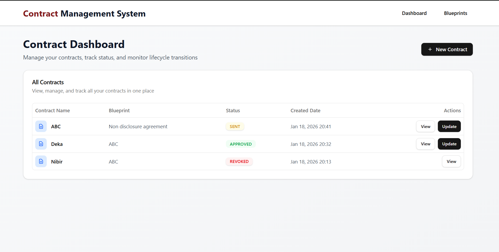
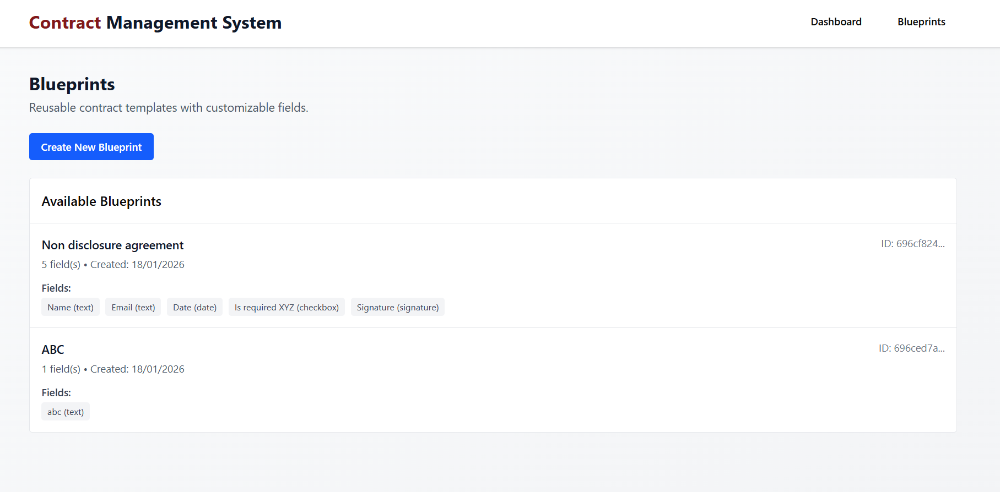
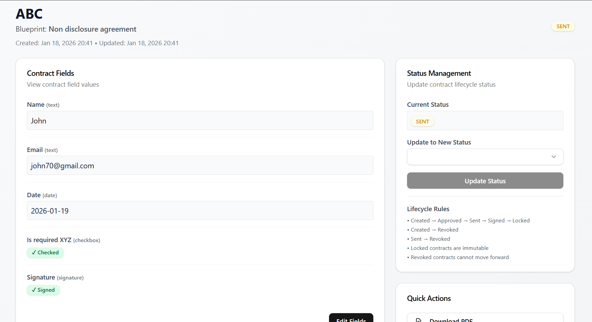

# Contract Management Platform (Full Stack)

An end-to-end **Contract Management Platform** built as a full-stack assignment.  
The system allows creating reusable contract blueprints, generating contracts from those blueprints, and managing contracts through a **strictly enforced lifecycle**.

The focus of this project is **backend architecture, data modeling, lifecycle enforcement, and clean frontend–backend integration**, rather than UI polish.

---

## Architecture Overview

### Tech Stack
- **Frontend**: React (Vite), JavaScript
- **State Management**: Zustand
- **Backend**: Node.js, Express
- **Database**: MongoDB (Mongoose)
- **API Style**: REST
- **Authentication**: Mocked / Not implemented (by design)

### High-Level Architecture
React (Frontend)
|
| REST APIs
|
Express (Backend)
|
MongoDB


The frontend consumes REST APIs exposed by the backend.  
All **business rules and lifecycle validation** are enforced on the backend.

---
## Application Screenshots

### Dashboard
Overview of all contracts and their current lifecycle status.



---

### Blueprint Builder
Create reusable contract blueprints with configurable fields.



---

### Contract Update & Lifecycle Management
Fill contract fields and manage lifecycle transitions with backend validation.



---

## Core Concepts

### Blueprint
A **Blueprint** is a reusable contract template containing configurable fields.

Supported field types:
- Text
- Date
- Signature (represented as a checkbox)
- Checkbox

Each field stores:
- `type`
- `label`
- `position { x, y }`

---

### Contract
A **Contract** is an instance created from a Blueprint.

- Inherits all blueprint fields
- Stores values entered by the user
- Has a controlled lifecycle
- Becomes immutable once locked

---

## Contract Lifecycle (CRITICAL)

Each contract follows a strictly enforced lifecycle:

- CREATED → APPROVED → SENT → SIGNED → LOCKED
- CREATED → REVOKED
- SENT → REVOKED

## Setup Guide

Follow the steps below to run the project locally.

---

###  Prerequisites
Make sure you have the following installed:

- Node.js (v18 or higher)
- npm or yarn
- MongoDB (local or MongoDB Atlas)

---

### 🧩 Clone the Repository
```bash
git clone https://github.com/Nibirdeka7/Contract-Management-System.git
cd contract-management-platform

cd backend
npm install

# Create environment file
echo "MONGODB_URI=your_mongo_uri_here" > .env
echo "PORT=5000" >> .env
echo "NODE_ENV=development" >> .env


npm run dev

# Open new terminal
cd frontend

# Install dependencies
npm install

# Start frontend server
npm run dev
```

## Check
Backend: Open http://localhost:5000/health (should return {"status":"OK"})
Frontend: Open http://localhost:3000 (should show dashboard)
## Routes

```javascript

router.route('/')
  .post(createBlueprint)
  .get(getBlueprints);

router.route('/:id')
  .get(getBlueprint);
```
---
```javascript
router.route('/')
  .post(createContract)
  .get(getContracts);

router.route('/:id')
  .get(getContract);

router.route('/:id/fields')
  .put(updateContractFields);

router.route('/:id/status')
  .put(updateContractStatus);

router.route('/:id/next-statuses')
  .get(getNextAvailableStatuses);


```